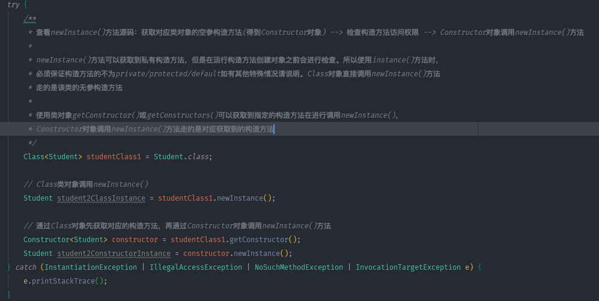
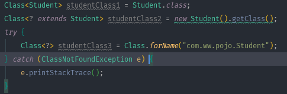
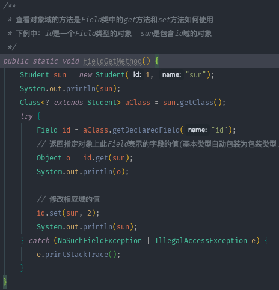
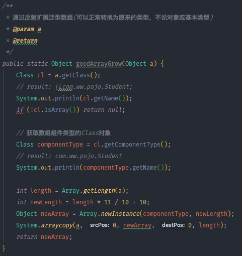

# problem
记录自己每日的问题code，以便复盘  

* 2019.07.09  
> 1、子类 instanceof 父类问题？  
>> instanceof关键字用于判断前面的对象是否是后面的类，或者其子类、实现类的实例。也就是说：使用instanceof关键字做判断时， instanceof 操作符的左右操作数必须有继承或实现关系。  

* 2019.07.10
> 1、为什么有常量还要有枚举类？
>> 先说一下两者的区别  
    1、常量就是一个值 ，枚举是一组不变的值  
    2、枚举是自己定义后再使用，有一定的约束，常量可以随便定义  
    3、枚举传入的值是固定的值不会出错，常量是一个值，传递的参数是任意的  
    4、限制用户不能随意赋值，只能在列举的值中选择  
   枚举的优点：
  
   1、枚举可以使代码更易于维护，有助于确保给变量指定合法的、期望的值  
   2、枚举使代码更清晰，允许用描述性的名称表示整数值，而不是用含义模糊的数来表示    
   3、枚举可以给出状态码的情况下再给出描述信息，常量类是做不到的    
   推荐枚举类型的使用，可以让代码结构更加清晰易懂可扩展。而常量类可以收集管理一些比较杂的一些常量。而接口的中的常量，在遵循开闭原则的基础上，向上抽象管理自己的内聚的常量。(不建议在接口中定义常量。如果某个实现了常量接口的类被修改不再需要常量了，也会因为序列化兼容原因不得不保持该实现，而且非final类实现常量接口会导致所有子类被污染)

> 2、一方库、一方库、一方库都指的是什么？
>>  一方库：本工程中的各模块的相互依赖  
  二方库：公司内部的依赖库，一般指公司内部的其他项目发布的jar包  
  三方库：公司之外的开源库， 比如apache、ibm、google等发布的依赖  
  
> 3、Objects.equals()方法传入两个对象会走第一个对象重equals方法还是Object类的equals方法？
>> 如果第一个对象重写了equals方法，走的就是对象的equals方法，如果没有重写，走Object类中的equals方法。  

> 4、Integer.parseInt()和Integer.parseInt()的区别是什么?  
>> parseInt()返回的为int类型，valueOf()返回的是Integer类型  

* 2019.07.11
> 1、JPA Example是否可以进行and查询？  
>> 可以的，直接在实体当中为多个域进行赋值即可。  

> 2、工具类是单例的吗？比如我有一个工具类是用来上传文件的，那如果他是单例的，如果第一个任务在使用这个工具类，那么第二个任务呢？  
>> 单例并非同一时间段只能被一个任务使用。其次工具类也不能说是单例的，因为工具类中的所有方法都是静态的，根本不涉及对象。而单例模式是针对于对象来说的。

> 3、Executors中submit()和execute()的区别?  
>> (1)submit()方法有返回值，  
   (2)使用submit()方法可以让调用者感知线程中的异常。  
    其实submit()是先构造出一个RunnableFuture(FutureTask) 然后再去调用execute方法。不管你submit的时候传入的是Runnable还是Callable，  
最后RunnableFuture(FutureTask)里面都会生成Callable对象。任务调用的时候调用RunnableFuture(FutureTask)的run方法，run方法调用Callable对象的call方法。

* 2019.07.15  
> 1、线程池如何在web项目中正确使用？  
>> 定义一个全局的静态变量  
    eg: `static final ExecutorService executors = Executors.newCachedThreadPool();`  
    当有请求过来需要处理的时候：`executors.submit(new StudentCallable);`  
    该线程池不要shutdown，线程池跟随整个服务的生命周期。  

> 2、Java各类对象的作用？   ()
>> • DO(Data Object):此对象与数据库表结构一一对应，通过 DAO 层向上传输数据源对象。  
   • DTO(Data Transfer Object):数据传输对象，Service 或 Manager 向外传输的对象。  
   • BO(Business Object):业务对象，由 Service 层输出的封装业务逻辑的对象。  
   • AO(Application Object):应用对象，在 Web 层与 Service 层之间抽象的复用对象模型，极为贴近展示层，复用度不高。  
   • VO(View Object):显示层对象，通常是 Web 向模板渲染引擎层传输的对象。  
   • Query:数据查询对象，各层接收上层的查询请求。注意超过 2 个参数的查询封装，禁止使用 Map 类来传输。  
     

* 2019.07.16
> 1、集合完成初始化后，分配内存空间了吗？  
>> ArrayList集合指定初始容量进行初始化的时候内部会new出一个指定初始容量的数组出来，但是我们为什么new完了不add元素，进行get元素的时候会数组越界呢？  
这是因为在ArrayList中有一个size的原因，这个size代表的是数组的当前非空长度。初始化的时候虽然new出指定 初始容量的数组，  
但是并没有将初始容量赋值给size。所有get的时候会抛出异常。 最终结论：集合完成初始化后是分配了内存空间的。  

> 2、数组构造完成后有默认值吗？  
>> 有的  

> 3、List类中add()方法和set()方法的区别？  
>> add()方法为集合添加元素，set()方法为修改集合中已存在的元素。  
  
> List类中set()方法可不可以元素为空的地址set值？  
>> set()方法不可以为元素为空的地址set值，会抛出IndexOutOfBoundsException   
 
> 4、包装对象可以二次赋值吗？  
>>  不可以，因为包装对象为不可变对象。二次赋值实际上会改变变量指向的内存空间地址。
 
> 5、为什么可以直接打印集合，数组就不行呢？
>> 因为ArrayList继承AbstractCollection，此类重写了Object类中的toString()方法，而数组并没有重写toString()方法。

> 6、为什么数组不重写toString()方法呢？  
>> 为了节省内存，首先数组也是类 数组类是虚拟机自动生成的 继承自Object 本身没有任何字段和方法 实现了Cloneable和Serializable接口  
数组和arraylist的区别是 arraylist是一个类 是有限的 而数组理论上是无限的 有int数组 byte数组 string数组 任何类型 都可以对应到  
几百个数组 一维数组 二维数组到最多255维数组  因此如果虚拟机实现把自动生成的数组类加一个重写后的toString方法 那么如果有大量的不同  
类型的数组 将会增加大量的内存占用 因为重写的方法的字节码是在虚拟机内存中保存的。  

> 7、不可变对象的优缺点？  
>> 优点:   
(1)构造、测试和使用都很简单  
(2)线程安全且没有同步问题，不需要担心数据会被其它线程修改  
(3)当用作类的属性时不需要保护性拷贝   
(4)可以很好的用作Map键值和Set元素  
缺点:  
(1)不可变对象最大的缺点就是创建对象的开销，因为每一步操作都会产生一个新的对象。  

> 8、如何编写一个不可变类？
>>  (1)确保类不能被继承 - 将类声明为final, 或者使用静态工厂并声明构造器为private  
(2) 声明属性为private 和 final  
(3) 不要提供任何可以修改对象状态的方法(不仅仅是set方法, 还有任何其它可以改变状态的方法)  
(4) 如果类有任何可变对象属性, 那么当它们在类和类的调用者间传递的时候必须被保护性拷贝  

> 9、唯一约束和唯一索引在 MySQL 数据库里区别？  
(1)概念上不同，约束是为了保证数据的完整性，索引是为了辅助查询；    
(2)创建唯一约束时，会自动的创建唯一索引；  
(3)在理论上，不一样，在实际使用时，基本没有区别。  

* 2019.07.17
> 1、获取class对象的三种方式？

> 2、通过反射创建对象的方式？  

> 3、基本类型或数组类型调用getDeckaredFields()方法会返回一个长度为0的数组  
  
> 4、反射中 getMethods返回当前类中的共有方法和从父类继承的公有方法，getDeclaredMethods返回的只有当前类中的所有方法  
  
> 5、Field类中get与set方法    
  
  
> 6、通过反射扩展泛型数组   
   

> 7、继承设计的技巧  
>> (1)将公共操作和域放在超类中   
   (2)不要使用受保护的域(任何人都能够从某个类派生出子类、同包中的类  这两者都可以直接访问protected域，破坏了封装性)  
   (3)当两个类为"is-a"关系时使用继承  
   (4)除非所有继承的方法都有意义，否则不要使用继承  
   (5)在覆盖方法时，不要改变预期的行为   
   (6)不要过多的使用反射，反射可以在运行时查看域和方法，让人们编写更具有通用型的程序。反射对于编写系统程序来说很实用，但是不适合编写应用程序  
  
* 2019.07.18  
> 1、git如何从指定的远程分支pull代码到当前分支？
>> `git pull origin <远程分支名>`  

* 2019.07.19
> 1、如果先在一个接口中将一个方法定义为默认方法， 然后又在超类或另一个接口中定义了同样的方法，会发生什么情况?  
>> (1)超类优先，如果超类提供了一个具体方法，同名而且有相同参数类型的默认方法会被忽略。
   (2)接口冲突，如果一个超接口提供了一个默认方法，另一个接口提供了一个同名而且参数类型(不论是否是默认参数)相同的方法，必须覆盖这个方法来解决冲突。