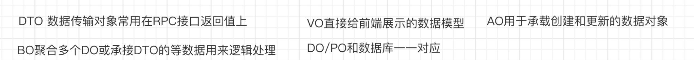

# problem
记录自己每日的问题code，以便复盘  

* 2019.07.09  
> 1、子类 instanceof 父类问题？  
>> instanceof关键字用于判断前面的对象是否是后面的类，或者其子类、实现类的实例。也就是说：使用instanceof关键字做判断时， instanceof 操作符的左右操作数必须有继承或实现关系。  

* 2019.07.10
> 1、为什么有常量还要有枚举类？
>> 先说一下两者的区别  
    1、常量就是一个值 ，枚举是一组不变的值  
    2、枚举是自己定义后再使用，有一定的约束，常量可以随便定义  
    3、枚举传入的值是固定的值不会出错，常量是一个值，传递的参数是任意的  
    4、限制用户不能随意赋值，只能在列举的值中选择  
   枚举的优点：
  
   1、枚举可以使代码更易于维护，有助于确保给变量指定合法的、期望的值  
   2、枚举使代码更清晰，允许用描述性的名称表示整数值，而不是用含义模糊的数来表示    
   3、枚举可以给出状态码的情况下再给出描述信息，常量类是做不到的    
   推荐枚举类型的使用，可以让代码结构更加清晰易懂可扩展。而常量类可以收集管理一些比较杂的一些常量。而接口的中的常量，在遵循开闭原则的基础上，向上抽象管理自己的内聚的常量。(不建议在接口中定义常量。如果某个实现了常量接口的类被修改不再需要常量了，也会因为序列化兼容原因不得不保持该实现，而且非final类实现常量接口会导致所有子类被污染)

> 2、一方库、一方库、一方库都指的是什么？
>>  一方库：本工程中的各模块的相互依赖  
  二方库：公司内部的依赖库，一般指公司内部的其他项目发布的jar包  
  三方库：公司之外的开源库， 比如apache、ibm、google等发布的依赖  
  
> 3、Objects.equals()方法传入两个对象会走第一个对象重equals方法还是Object类的equals方法？
>> 如果第一个对象重写了equals方法，走的就是对象的equals方法，如果没有重写，走Object类中的equals方法。  

> 4、Integer.parseInt()和Integer.parseInt()的区别是什么?  
>> parseInt()返回的为int类型，valueOf()返回的是Integer类型  

* 2019.07.11
> 1、JPA Example是否可以进行and查询？  
>> 可以的，直接在实体当中为多个域进行赋值即可。  

> 2、工具类是单例的吗？比如我有一个工具类是用来上传文件的，那如果他是单例的，如果第一个任务在使用这个工具类，那么第二个任务呢？  
>> 单例并非同一时间段只能被一个任务使用。其次工具类也不能说是单例的，因为工具类中的所有方法都是静态的，根本不涉及对象。而单例模式是针对于对象来说的。

> 3、Executors中submit()和execute()的区别?  
>> (1)submit()方法有返回值，  
   (2)使用submit()方法可以让调用者感知线程中的异常。  
    其实submit()是先构造出一个RunnableFuture(FutureTask) 然后再去调用execute方法。不管你submit的时候传入的是Runnable还是Callable，  
最后RunnableFuture(FutureTask)里面都会生成Callable对象。任务调用的时候调用RunnableFuture(FutureTask)的run方法，run方法调用Callable对象的call方法。

* 2019.07.15  
> 1、线程池如何在web项目中正确使用？  
>> 定义一个全局的静态变量  
    eg: `static final ExecutorService executors = Executors.newCachedThreadPool();`  
    当有请求过来需要处理的时候：`executors.submit(new StudentCallable);`  
    该线程池不要shutdown，线程池跟随整个服务的生命周期。  

> 2、Java各类对象的作用？   ()
>> • DO(Data Object):此对象与数据库表结构一一对应，通过 DAO 层向上传输数据源对象。  
   • DTO(Data Transfer Object):数据传输对象，Service 或 Manager 向外传输的对象。  
   • BO(Business Object):业务对象，由 Service 层输出的封装业务逻辑的对象。  
   • AO(Application Object):应用对象，在 Web 层与 Service 层之间抽象的复用对象模型，极为贴近展示层，复用度不高。  
   • VO(View Object):显示层对象，通常是 Web 向模板渲染引擎层传输的对象。  
   • Query:数据查询对象，各层接收上层的查询请求。注意超过 2 个参数的查询封装，禁止使用 Map 类来传输。  
     

